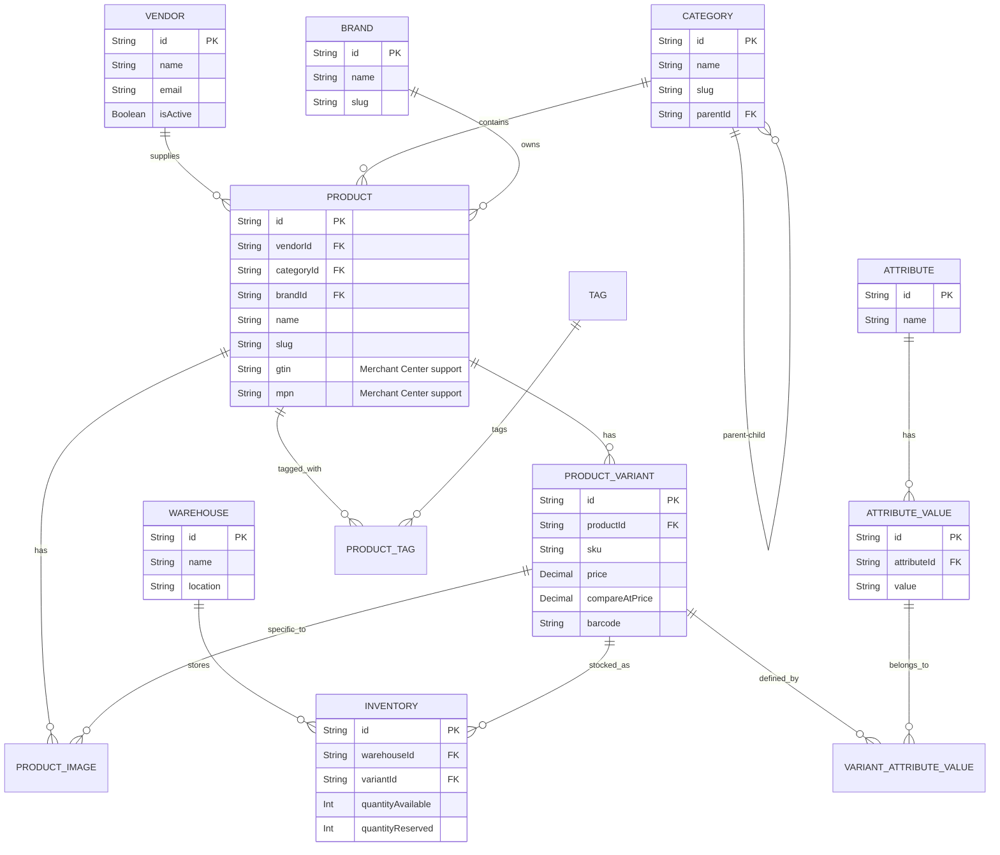

# Enterprise Ecommerce Catalog Management System

## 1. Database ERD (Entity Relationship Diagram)



## 2. API Design (RESTful)

### Categories
- `GET /api/v1/categories` - List categories (tree structure)
- `POST /api/v1/categories` - Create a category
- `PUT /api/v1/categories/:id` - Update category
- `DELETE /api/v1/categories/:id` - Delete category

### Brands
- `GET /api/v1/brands` - List brands
- `POST /api/v1/brands` - Create a brand

### Products (Catalog)
- `GET /api/v1/products` - List products (supports filtering by brand, category, vendor, tags)
- `GET /api/v1/products/:id` - Get product details (includes variants, attributes, images)
- `POST /api/v1/products` - Create product
- `PUT /api/v1/products/:id` - Update product
- `DELETE /api/v1/products/:id` - Soft delete product

### Product Variants
- `GET /api/v1/products/:productId/variants` - List variants for product
- `POST /api/v1/products/:productId/variants` - Create variant
- `PUT /api/v1/variants/:id` - Update variant details (price, sku, attributes)
- `DELETE /api/v1/variants/:id` - Remove variant

### Attributes & Values
- `GET /api/v1/attributes` - List all attribute types (e.g., Color, Size)
- `POST /api/v1/attributes` - Create attribute type
- `POST /api/v1/attributes/:id/values` - Add possible values (e.g., Red, XL)

### Inventory & Warehouses
- `GET /api/v1/warehouses` - List warehouses
- `GET /api/v1/inventory` - Get global inventory levels
- `POST /api/v1/inventory/adjust` - Adjust inventory (increment/decrement)
- `POST /api/v1/inventory/transfer` - Transfer inventory between warehouses

### Pixels & Feeds
- `GET /api/v1/feeds/google-merchant` - Generate XML/CSV feed for Google Merchant Center
- `GET /api/v1/feeds/facebook-catalog` - Generate feed for Meta Commerce Manager

## 3. Folder Structure

```
/src
  /backend
    /config           # DB, Env, Logger setup
    /controllers      # Request handlers
      - category.controller.ts
      - brand.controller.ts
      - product.controller.ts
      - variant.controller.ts
      - inventory.controller.ts
      - feed.controller.ts
    /middlewares      # Auth, Validation, Error Handling
    /routes           # Express routing
      - category.routes.ts
      - brand.routes.ts
      - product.routes.ts
      - inventory.routes.ts
    /services         # Business logic
      - catalog.service.ts
      - inventory.service.ts
      - feed-generator.service.ts
    /utils            # Helpers (Slug generator, etc.)
    /validations      # Zod schemas for request validation
  /frontend
    /components
      /catalog        # Category tree, Product cards, Filters
      /inventory      # Stock management grids
    /hooks            # React Query hooks
    /lib              # GA4, Pixel tracking utils
    /pages
      /products       # Product listing, creation, edit
      /categories     # Category management
      /inventory      # Warehouse stock management
    /services         # Axios API clients
    /store            # Global state (Zustand/Redux)
```
