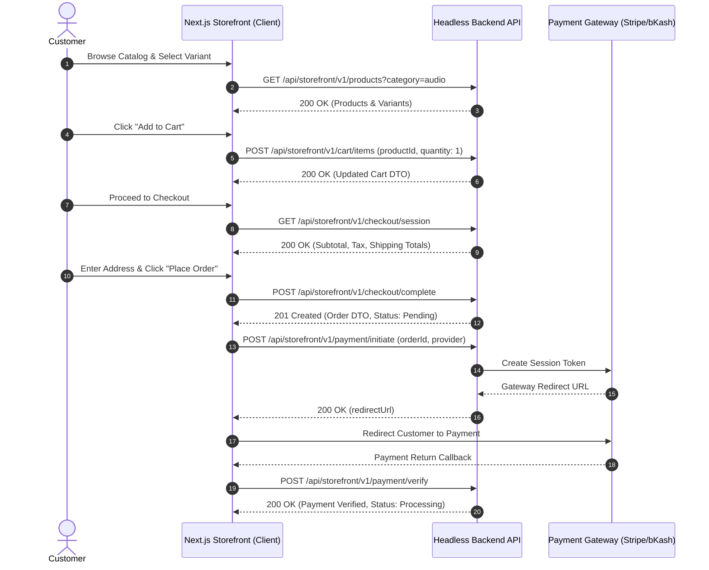

# STOREFRONT IMPLEMENTATION HANDOVER & ARCHITECTURAL PACKAGE

**Document Version:** 1.0.0  
**Target Architecture:** Headless E-Commerce Storefront (Next.js 14+ App Router / React / TypeScript / Tailwind CSS)  
**Backend Framework:** Node.js / Express / TypeScript / Prisma / PostgreSQL / Cloudinary  
**Base API Endpoint:** `/api/storefront/v1`  
**Authentication Standard:** HTTP Bearer JWT Tokens (`Authorization: Bearer <CustomerJWT>`)  

---

## 1. HANDOVER PURPOSE & SYSTEM ARCHITECTURE

This document is a comprehensive, self-contained implementation specification for building a production-ready **Next.js Storefront** without requiring access to the backend source code. All backend endpoints, data schemas, authentication lifecycles, checkout sequences, and media handling rules are documented below.

### 1.1 High-Level Headless Architecture

```
┌─────────────────────────────────────────────────────────────────────────────┐
│                       NEXT.JS STOREFRONT APPLICATION                        │
│   (App Router / Server Components / Client Hooks / Contexts / Tailwind)     │
└──────────────────────┬───────────────────────────────▲──────────────────────┘
                       │                               │
             REST API Calls (JSON)             JWT Bearer Tokens
            /api/storefront/v1/*               Auth & Cart Sync
                       │                               │
                       ▼                               │
┌──────────────────────────────────────────────────────┴──────────────────────┐
│                        HEADLESS NODE.JS EXPRESS API                         │
│                  (Route Handlers / Validation / Services)                   │
├──────────────────────────────┬──────────────────────────────┬───────────────┤
│    PostgreSQL (Prisma DB)    │     Cloudinary CDN Media     │ GA4 Analytics │
│ (Products, Orders, Customers)│ (Product Images & Thumbnails)│ (Data Layer)  │
└──────────────────────────────┴──────────────────────────────┴───────────────┘
```

### 1.2 Global API Standards & Conventions

1. **Protocol & Content-Type:** All API requests and responses use JSON (`application/json`), except file uploads (`multipart/form-data`).
2. **Standard Response Envelope:**
   ```json
   {
     "success": true,
     "message": "Optional status message",
     "data": { ... },
     "meta": {
       "total": 120,
       "page": 1,
       "limit": 20,
       "totalPages": 6,
       "hasNextPage": true,
       "hasPreviousPage": false
     }
   }
   ```
3. **Standard Error Envelope:**
   ```json
   {
     "success": false,
     "error": {
       "code": "VALIDATION_ERROR | UNAUTHORIZED | FORBIDDEN | NOT_FOUND | STOCK_UNAVAILABLE",
       "message": "Human-readable error explanation",
       "details": [ ... ]
     }
   }
   ```
4. **Financial Accuracy:** All monetary amounts are numeric floats rounded to 2 decimal places (representing exact values derived from PostgreSQL `@db.Decimal(10,2)`).

---

## 2. TYPESCRIPT DATA CONTRACTS & ENTITY SCHEMAS

The Next.js storefront should define these exact TypeScript interfaces (`src/types/storefront.ts`) to interact with the backend API.

```typescript
// --- CATALOG & DISCOVERY TYPES ---

export interface StorefrontProductImage {
  id: string;
  url: string;
  imageUrl?: string;
  publicId?: string | null;
  altText: string | null;
  isPrimary: boolean;
  sortOrder: number;
}

export interface StorefrontCategory {
  id: string;
  name: string;
  slug: string;
  description: string | null;
  image: string | null;
  icon: string | null;
  parentId: string | null;
  seoTitle: string;
  seoDescription: string | null;
  ogImage: string | null;
  children?: StorefrontCategory[];
}

export interface StorefrontBrand {
  id: string;
  name: string;
  slug: string;
  logoUrl: string | null;
  description: string | null;
  seoTitle: string;
  seoDescription: string | null;
  ogImage: string | null;
  website?: string | null;
}

export interface StorefrontVariant {
  id: string;
  sku: string | null;
  barcode: string | null;
  price: number | null;
  compareAtPrice: number | null;
  stock: number;
  inStock: boolean;
  options: Record<string, string>; // e.g. { "Color": "Black", "Storage": "256GB" }
  image: string | null;
}

export interface StorefrontProduct {
  id: string;
  name: string;
  slug: string;
  description: string | null;
  shortDescription: string | null;
  price: number | null;
  seoTitle: string;
  seoDescription: string | null;
  ogImage: string | null;
  gtin: string | null;
  mpn: string | null;
  condition: string | null;
  category?: StorefrontCategory;
  brand?: StorefrontBrand | null;
  images?: StorefrontProductImage[];
  variants?: StorefrontVariant[];
  tags?: string[];
  thumbnail?: string | null;
  gallery?: StorefrontProductImage[];
  primaryImage?: StorefrontProductImage | string | null;
}

// --- CART & WISHLIST TYPES ---

export interface CartItem {
  id: string;
  productId: string;
  variantId: string | null;
  quantity: number;
  price: number;
  totalPrice: number;
  product: {
    id: string;
    name: string;
    slug: string;
    thumbnail: string | null;
  };
  variant?: {
    id: string;
    sku: string | null;
    options: Record<string, string>;
    image: string | null;
  } | null;
}

export interface Cart {
  id: string;
  customerId: string | null;
  items: CartItem[];
  subtotal: number;
  itemCount: number;
  createdAt: string;
  updatedAt: string;
}

export interface WishlistItem {
  id: string;
  productId: string;
  createdAt: string;
  product: StorefrontProduct;
}

// --- CHECKOUT & ORDER TYPES ---

export interface CheckoutSummary {
  subtotal: number;
  discountAmount: number;
  shippingAmount: number;
  taxAmount: number;
  totalAmount: number;
  couponCode: string | null;
  items: CartItem[];
}

export interface OrderItem {
  id: string;
  quantity: number;
  price: number;
  productName: string;
  productSlug: string;
  productImage: string | null;
  variantSku: string | null;
}

export interface OrderTimeline {
  id: string;
  status: string;
  action: string;
  createdAt: string;
}

export interface Order {
  id: string;
  orderNumber: string;
  status: 'Pending' | 'Processing' | 'Shipped' | 'Delivered' | 'Cancelled';
  paymentStatus: 'Unpaid' | 'Paid' | 'Failed' | 'Refunded';
  totalAmount: number;
  shippingAddress: string;
  billingAddress: string;
  paymentMethod: string;
  createdAt: string;
  updatedAt: string;
  coupon?: {
    code: string;
    discountType: string;
    discountValue: number;
  } | null;
  items: OrderItem[];
  timeline: OrderTimeline[];
}

export interface ShipmentItem {
  id: string;
  quantity: number;
  productName: string;
}

export interface TrackingEvent {
  id: string;
  status: string;
  location: string | null;
  description: string;
  timestamp: string;
}

export interface Shipment {
  id: string;
  trackingNumber: string;
  status: 'PENDING' | 'PROCESSING' | 'PACKED' | 'SHIPPED' | 'IN_TRANSIT' | 'OUT_FOR_DELIVERY' | 'DELIVERED' | 'FAILED_DELIVERY' | 'RETURNED';
  shippedAt: string | null;
  estimatedDelivery: string | null;
  courierName: string | null;
  trackingUrl: string | null;
  createdAt: string;
  items: ShipmentItem[];
  trackingEvents: TrackingEvent[];
}

export interface ReturnRequest {
  id: string;
  orderId: string;
  reason: string;
  status: 'REQUESTED' | 'APPROVED' | 'REJECTED' | 'RECEIVED' | 'REFUNDED' | 'CLOSED';
  createdAt: string;
  items: {
    id: string;
    quantity: number;
    reason: string;
    condition: string;
    productName: string;
    productImage: string | null;
  }[];
}

export interface Refund {
  id: string;
  orderId: string;
  amount: number;
  currency: string;
  status: 'PENDING' | 'PROCESSING' | 'COMPLETED' | 'FAILED' | 'REJECTED';
  reason: string;
  createdAt: string;
  provider: string | null;
}

// --- STORE CONTENT & MARKETING TYPES ---

export interface PublicSettings {
  branding: {
    siteName: string;
    siteTitle: string;
    siteTagline: string;
    logoUrl: string | null;
    darkLogoUrl: string | null;
    faviconUrl: string | null;
  };
  seo: {
    metaTitle: string;
    metaDescription: string;
    ogImageUrl: string | null;
  };
  shipping: {
    flatRateShipping: number;
    freeShippingThreshold: number;
    estimatedDeliveryDays: number;
  };
  tax: {
    taxRatePercentage: number;
    pricesIncludeTax: boolean;
  };
  general: {
    storeEmail: string;
    storePhone: string;
    currency: string;
    currencySymbol: string;
    maintenanceMode: boolean;
  };
}

export interface Banner {
  id: string;
  title: string;
  desktopImage: string;
  mobileImage: string;
  linkUrl: string;
  ctaText: string;
  priority: number;
  isActive: boolean;
}

export interface Popup {
  id: string;
  title: string;
  type: string;
  headline: string;
  body: string;
  couponCode?: string;
  imageUrl?: string;
  delaySeconds: number;
  isActive: boolean;
}
```

---

## 3. EXHAUSTIVE API ENDPOINT REFERENCE

### 3.1 Authentication & Customer Account (`/api/storefront/v1/auth`)

| Endpoint | Method | Auth Required | Description | Request Payload | Response Data |
|----------|--------|---------------|-------------|-----------------|---------------|
| `/api/storefront/v1/auth/register` | `POST` | No | Registers new customer account | `{ email, password, firstName, lastName, phone }` | `{ customer, accessToken, refreshToken }` |
| `/api/storefront/v1/auth/login` | `POST` | No | Authenticates customer credentials | `{ email, password }` | `{ customer, accessToken, refreshToken }` |
| `/api/storefront/v1/auth/me` | `GET` | Bearer | Fetches current logged-in customer profile | None | `{ id, email, firstName, lastName, phone, shippingAddress, billingAddress }` |
| `/api/storefront/v1/auth/refresh` | `POST` | No | Refreshes expired access token | `{ refreshToken }` | `{ accessToken, refreshToken }` |
| `/api/storefront/v1/auth/logout` | `POST` | Bearer | Revokes session refresh token | None | `{ success: true }` |

---

### 3.2 Product Catalog & Search (`/api/storefront/v1/products` & `/search`)

#### List Products: `GET /api/storefront/v1/products`
- **Query Parameters:**
  - `page` (`number`, default: `1`)
  - `limit` (`number`, default: `20`, max: `100`)
  - `search` / `q` (`string`, filters title, description, SKU)
  - `category` (`string`, category slug or ID)
  - `brand` (`string`, brand slug or ID)
  - `minPrice` / `maxPrice` (`number`, price range filter)
  - `sort` (`newest`, `oldest`, `price_asc`, `price_desc`, `name_asc`, `name_desc`)
- **Response Format (`200 OK`):**
  ```json
  {
    "success": true,
    "data": [
      {
        "id": "prod-101",
        "name": "Wireless Noise Cancelling Headphones",
        "slug": "wireless-noise-cancelling-headphones",
        "price": 199.99,
        "thumbnail": "https://res.cloudinary.com/demo/image/upload/v1/headphones.jpg",
        "category": { "id": "cat-01", "name": "Audio", "slug": "audio" },
        "brand": { "id": "br-01", "name": "SoundMax", "slug": "soundmax" },
        "primaryImage": { "url": "https://res.cloudinary.com/demo/image/upload/v1/headphones.jpg", "altText": "Front view" },
        "gallery": [ ... ],
        "variants": [ ... ]
      }
    ],
    "meta": { "total": 45, "page": 1, "limit": 20, "totalPages": 3, "hasNextPage": true, "hasPreviousPage": false }
  }
  ```

#### Get Single Product Details: `GET /api/storefront/v1/products/:slug`
- **Response:** Returns full `StorefrontProduct` object including complete gallery array, detailed category/brand breakdown, and active variants with attribute mapping. Returns `404 Not Found` if slug is invalid or inactive.

#### Categories & Brands:
- `GET /api/storefront/v1/categories`: Returns full category tree with parent-child relationships and category images.
- `GET /api/storefront/v1/brands`: Returns list of active brands with logo URLs and web links.

#### Faceted Search:
- `GET /api/storefront/v1/search?q=wireless`: Returns products matching query.
- `GET /api/storefront/v1/search/facets?q=wireless`: Returns category count distributions, brand counts, and min/max price bounds for filter widgets.

---

### 3.3 Wishlist & Cart Operations (`/api/storefront/v1/wishlist` & `/cart`)

| Endpoint | Method | Auth | Payload | Description |
|----------|--------|------|---------|-------------|
| `GET /api/storefront/v1/wishlist` | `GET` | Bearer | None | Fetches saved customer wishlist items |
| `POST /api/storefront/v1/wishlist/:productId` | `POST` | Bearer | None | Saves product to customer wishlist |
| `DELETE /api/storefront/v1/wishlist/:productId` | `DELETE` | Bearer | None | Removes product from wishlist |
| `GET /api/storefront/v1/cart` | `GET` | Guest/Bearer | None | Retrieves active shopping cart session |
| `POST /api/storefront/v1/cart/items` | `POST` | Guest/Bearer | `{ productId, variantId, quantity }` | Adds line item to cart & checks stock |
| `PUT /api/storefront/v1/cart/items/:itemId` | `PUT` | Guest/Bearer | `{ quantity }` | Updates line item quantity (0 removes) |
| `DELETE /api/storefront/v1/cart/items/:itemId` | `DELETE` | Guest/Bearer | None | Removes specific item from cart |
| `DELETE /api/storefront/v1/cart` | `DELETE` | Guest/Bearer | None | Clears all items in current cart |

---

### 3.4 Multi-Step Checkout & Payment Execution (`/api/storefront/v1/checkout` & `/payment`)

#### Checkout Sequence Steps:

1. **Calculate Session Totals (`GET /api/storefront/v1/checkout/session`):**
   - Calculates Subtotal, Tax (using `TaxSetting`), Shipping Fee (using `ShippingSetting`), and applies active discount.
2. **Apply Coupon Code (`POST /api/storefront/v1/checkout/coupon`):**
   - Body: `{ "code": "SUMMER20" }`
   - Validates expiry, minimum spend, and per-customer usage limits.
3. **Complete Order Placement (`POST /api/storefront/v1/checkout/complete`):**
   - Body:
     ```json
     {
       "shippingAddress": "123 Tech Blvd, Austin, TX 78701",
       "billingAddress": "123 Tech Blvd, Austin, TX 78701",
       "paymentMethod": "STRIPE",
       "orderNotes": "Please leave package at front porch."
     }
     ```
   - Executes atomic DB transaction: checks stock availability, reserves inventory, creates `Order` with status `Pending`, and clears the active shopping cart. Returns created `Order` object.
4. **Initiate Payment Gateway (`POST /api/storefront/v1/payment/initiate`):**
   - Body: `{ "orderId": "ord-123", "provider": "STRIPE" }` (Supported: `COD`, `BKASH`, `NAGAD`, `SSLCOMMERZ`, `STRIPE`)
   - Returns payment session gateway URL (`redirectUrl`) or token for client JS SDK.
5. **Verify Payment Result (`POST /api/storefront/v1/payment/verify`):**
   - Body: `{ "paymentId": "pay-555", "transactionRef": "trx-998811" }`
   - Marks payment status `Paid` and order status `Processing`.

---

### 3.5 Customer Order History, Shipments & Returns

- `GET /api/storefront/v1/orders`: Returns customer order list with status, totals, and line item thumbnails.
- `GET /api/storefront/v1/orders/:id`: Returns full order breakdown including status timeline.
- `GET /api/storefront/v1/orders/:id/shipments`: Returns shipment tracking number, courier info, tracking URL, and transit event list.
- `POST /api/storefront/v1/returns/request`: Submits return request for delivered order. Body: `{ orderId, items: [{ orderItemId, quantity, reason, condition }] }`.
- `GET /api/storefront/v1/returns`: Returns customer return requests and restock approval status.
- `GET /api/storefront/v1/refunds`: Returns settled refund transactions.

---

### 3.6 Public Settings & Store Content (`/api/storefront/v1/settings/public`)

#### Public Settings: `GET /api/storefront/v1/settings/public`
Provides storefront hydration config (Branding, SEO, Tax, Shipping rules, Store Email/Phone, Currency symbol).

#### Marketing & Content Endpoints:
- `GET /api/storefront/v1/banners`: Active homepage slider graphics with desktop/mobile image URLs and CTA links.
- `GET /api/storefront/v1/popups`: Exit-intent or welcome discount popups.
- `GET /api/storefront/v1/faqs`: Category-grouped customer FAQ list.
- `GET /api/storefront/v1/blog`: Published blog articles list.
- `GET /api/storefront/v1/blog/:slug`: Full blog article with featured media asset.
- `GET /api/storefront/v1/pages/:slug`: CMS static pages (Terms of Service, Privacy Policy, About Us).

---

## 4. END-TO-END CUSTOMER WORKFLOW DIAGRAMS



---

## 5. CLOUDINARY CDN MEDIA HANDLING

1. **CDN Domain:** Product images are served via Cloudinary HTTPS CDN (`https://res.cloudinary.com`).
2. **Next.js `next.config.js` Domain Configuration:**
   ```javascript
   module.exports = {
     images: {
       remotePatterns: [
         { protocol: 'https', hostname: 'res.cloudinary.com' },
         { protocol: 'https', hostname: 'via.placeholder.com' }
       ],
     },
   };
   ```
3. **Primary Image Resolution:**
   - Primary Image: `product.primaryImage?.url || product.thumbnail || product.images[0]?.url`
   - Secondary Gallery: `product.gallery` (array of `StorefrontProductImage` excluding primary image)
4. **Data URI Fallback:** In local dev mode without Cloudinary credentials, backend returns base64 string `data:image/png;base64,...` in the `url` field, which standard `` or `<Image unoptimized src="..." />` handles seamlessly.

---

## 6. GA4 ANALYTICS & DATA LAYER SPECIFICATION

The storefront must push these standardized Google Analytics 4 (GA4) events to `window.dataLayer`:

| Trigger Event | GA4 Event Name | Data Payload Structure |
|---------------|----------------|------------------------|
| View Product Detail | `view_item` | `{ currency: "USD", value: 199.99, items: [{ item_id: "prod-101", item_name: "Headphones", price: 199.99, item_category: "Audio" }] }` |
| Add to Cart Click | `add_to_cart` | `{ currency: "USD", value: 199.99, items: [{ item_id: "prod-101", quantity: 1, price: 199.99 }] }` |
| Remove from Cart | `remove_from_cart` | `{ currency: "USD", value: 199.99, items: [{ item_id: "prod-101", quantity: 1 }] }` |
| View Shopping Cart | `view_cart` | `{ currency: "USD", value: 399.98, items: [ ... ] }` |
| Click Checkout | `begin_checkout` | `{ currency: "USD", value: 399.98, coupon: "SUMMER20", items: [ ... ] }` |
| Order Success | `purchase` | `{ transaction_id: "ORD-1001", value: 349.49, tax: 25.00, shipping: 10.00, currency: "USD", items: [ ... ] }` |
| Add to Wishlist | `add_to_wishlist` | `{ currency: "USD", value: 199.99, items: [{ item_id: "prod-101" }] }` |

---

## 7. NEXT.JS STOREFRONT IMPLEMENTATION BOOTSTRAPPER

### 7.1 Recommended Directory Blueprint

```
nextjs-storefront/
├── app/
│   ├── (catalog)/
│   │   ├── products/
│   │   │   ├── page.tsx            # Catalog page with filter sidebar & sorting
│   │   │   └── [slug]/page.tsx     # Product Detail page (SSR / ISR)
│   │   └── categories/[slug]/
│   ├── cart/page.tsx               # Cart drawer / page
│   ├── checkout/page.tsx           # Multi-step checkout wizard
│   ├── account/
│   │   ├── orders/page.tsx         # Order history list
│   │   └── orders/[id]/page.tsx    # Order detail & shipment tracking
│   ├── blog/
│   ├── pages/[slug]/               # CMS static pages
│   ├── layout.tsx
│   └── page.tsx                    # Homepage (Banners, Featured Products, Popups)
├── src/
│   ├── components/
│   │   ├── catalog/ProductCard.tsx
│   │   ├── checkout/PaymentForm.tsx
│   │   └── ui/
│   ├── context/
│   │   ├── AuthContext.tsx         # Customer auth token state
│   │   └── CartContext.tsx         # Shopping cart state & server sync
│   ├── lib/
│   │   └── api.ts                  # Axios / Fetch client with Bearer token interceptor
│   └── types/
│       └── storefront.ts           # Shared TypeScript interfaces
```

### 7.2 API Client Interceptor (`src/lib/api.ts`)

```typescript
import axios from 'axios';

const API_BASE_URL = process.env.NEXT_PUBLIC_API_URL || 'https://api.yourdomain.com/api/storefront/v1';

export const api = axios.create({
  baseURL: API_BASE_URL,
  headers: {
    'Content-Type': 'application/json',
  },
});

// Automatically inject JWT Access Token into request headers
api.interceptors.request.use((config) => {
  if (typeof window !== 'undefined') {
    const token = localStorage.getItem('customerAccessToken');
    if (token) {
      config.headers.Authorization = `Bearer ${token}`;
    }
  }
  return config;
});

// Automatically handle token refresh on 401 Unauthorized
api.interceptors.response.use(
  (response) => response,
  async (error) => {
    const originalRequest = error.config;
    if (error.response?.status === 401 && !originalRequest._retry) {
      originalRequest._retry = true;
      try {
        const refreshToken = localStorage.getItem('customerRefreshToken');
        if (refreshToken) {
          const res = await axios.post(`${API_BASE_URL}/auth/refresh`, { refreshToken });
          const newAccessToken = res.data.data.accessToken;
          localStorage.setItem('customerAccessToken', newAccessToken);
          originalRequest.headers.Authorization = `Bearer ${newAccessToken}`;
          return api(originalRequest);
        }
      } catch (refreshErr) {        localStorage.removeItem('customerAccessToken');
        localStorage.removeItem('customerRefreshToken');
        if (typeof window !== 'undefined') {
          window.location.href = '/login';
        }
      }
    }
    return Promise.reject(error);
  }
);
```

---

*End of Storefront Implementation Handover & Architectural Package.*
