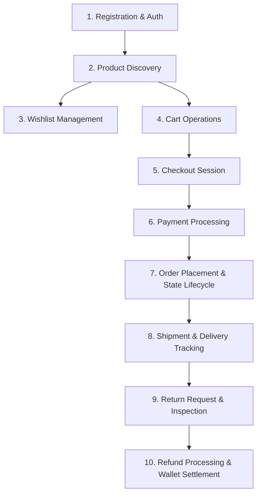
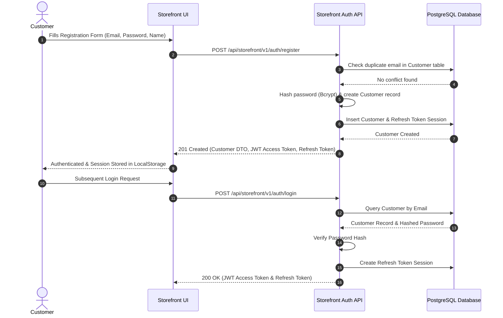
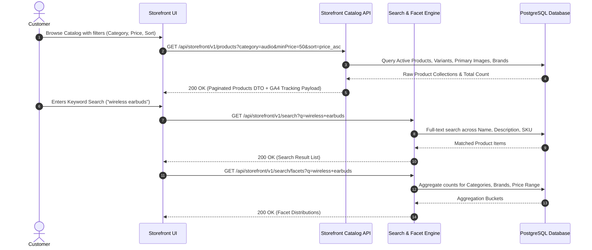
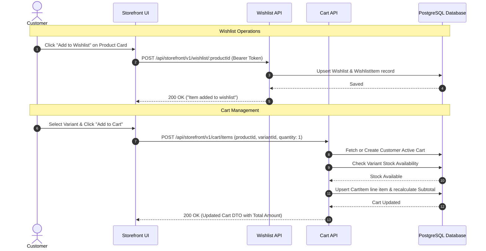
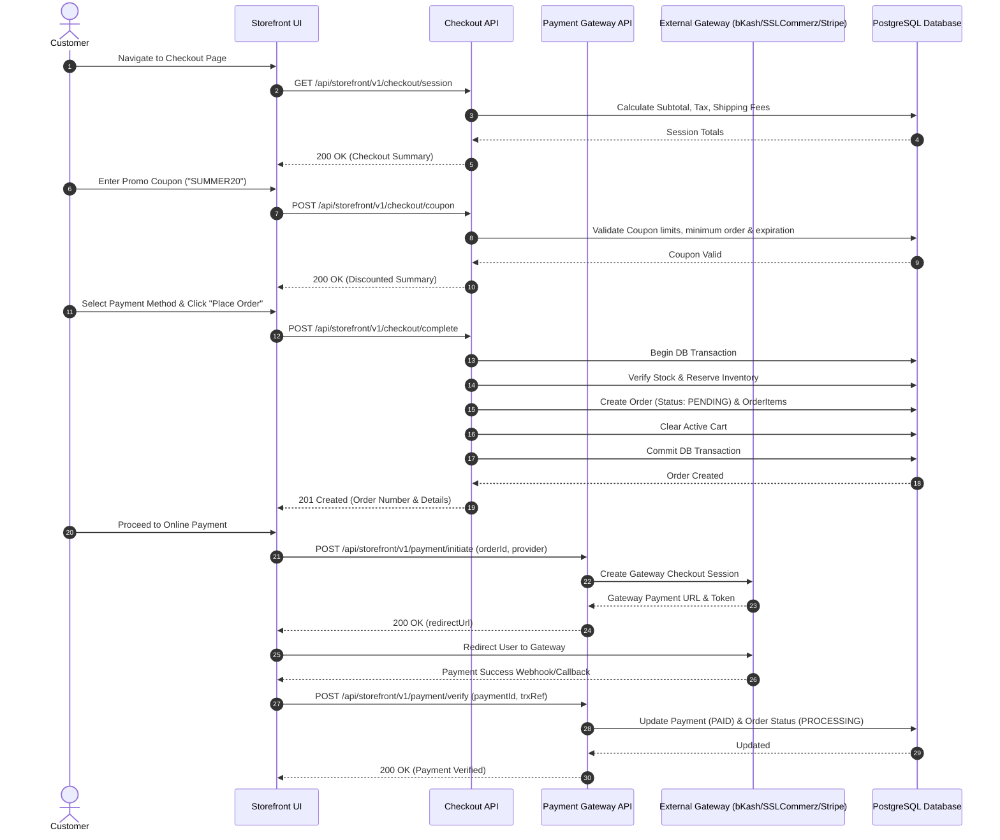
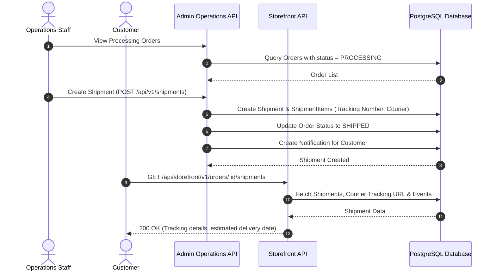
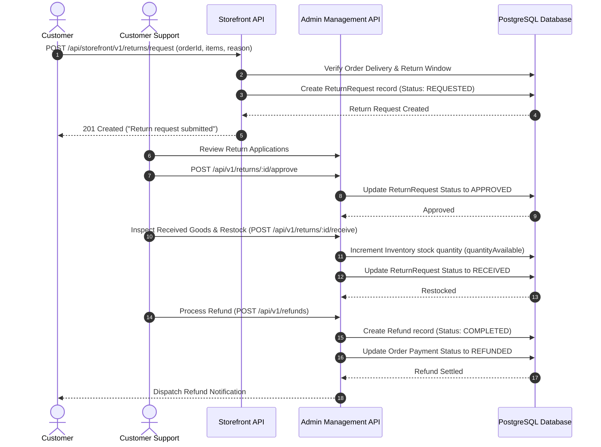

# END-TO-END CUSTOMER JOURNEY & STATE FLOW SPECIFICATION

This document details the complete end-to-end customer lifecycle for the e-commerce platform — from user registration and product discovery to order fulfillment, shipping, returns, and refunds.

---

## 1. HIGH-LEVEL CUSTOMER LIFECYCLE OVERVIEW



---

## 2. SEQUENCE DIAGRAMS BY LIFECYCLE STAGE

### 2.1 Customer Registration & Authentication Flow



---

### 2.2 Product Discovery & Search Flow



---

### 2.3 Wishlist & Cart Operations Flow



---

### 2.4 Checkout & Payment Execution Flow



---

### 2.5 Order Fulfillment, Shipment & Tracking Flow



---

### 2.6 Return & Refund Flow



---

## 3. STATE TRANSITION MAP

### 3.1 Order State Lifecycle Machine
```
[ PENDING ] ──(Payment Settled / COD Confirmed)──> [ PROCESSING ]
     │                                                    │
 (Cancelled)                                         (Fulfillment)
     ▼                                                    ▼
[ CANCELLED ]                                        [ SHIPPED ]
                                                          │
                                                     (Delivered)
                                                          ▼
                                                   [ DELIVERED ]
```

### 3.2 Return Request Lifecycle Machine
```
[ REQUESTED ] ──(Admin Review)──> [ APPROVED ] ──(Customer Ships Back)──> [ RECEIVED ]
      │                                                                         │
 (Rejected)                                                            (Restock & Refund)
      ▼                                                                         ▼
 [ REJECTED ]                                                             [ COMPLETED ]
```

---

## 4. COMPLETE STEP-BY-STEP API STEP SUMMARY

| Step | User Action | API Endpoint | Auth Header | Primary DB Action |
|------|-------------|--------------|-------------|-------------------|
| **1** | Register Account | `POST /api/storefront/v1/auth/register` | Public | Creates `Customer` & hashes password |
| **2** | Login Session | `POST /api/storefront/v1/auth/login` | Public | Generates JWT & inserts `Session` |
| **3** | Browse Products | `GET /api/storefront/v1/products` | Public | Queries `Product` with variants & images |
| **4** | Add to Wishlist | `POST /api/storefront/v1/wishlist/:id` | Bearer Customer | Inserts `WishlistItem` |
| **5** | Add to Cart | `POST /api/storefront/v1/cart/items` | Bearer Customer | Inserts/Updates `CartItem` |
| **6** | View Checkout | `GET /api/storefront/v1/checkout/session` | Bearer Customer | Calculates subtotal, tax & shipping |
| **7** | Apply Coupon | `POST /api/storefront/v1/checkout/coupon` | Bearer Customer | Validates & applies discount |
| **8** | Place Order | `POST /api/storefront/v1/checkout/complete` | Bearer Customer | Creates `Order`, reserves stock & clears cart |
| **9** | Pay Online | `POST /api/storefront/v1/payment/initiate` | Bearer Customer | Creates gateway token & payment link |
| **10** | Verify Payment | `POST /api/storefront/v1/payment/verify` | Bearer Customer | Marks `Payment` PAID & `Order` PROCESSING |
| **11** | Track Shipment | `GET /api/storefront/v1/orders/:id/shipments` | Bearer Customer | Queries `Shipment` & courier events |
| **12** | Submit Return | `POST /api/storefront/v1/returns/request` | Bearer Customer | Creates `ReturnRequest` |
| **13** | Receive Refund | `GET /api/storefront/v1/refund` | Bearer Customer | Checks settled `Refund` status |

---

*End of End-to-End Customer Journey & State Flow Specification.*
