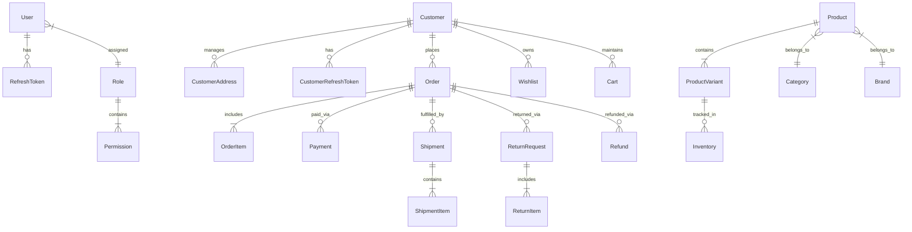

# Database Architecture & Schema Documentation

## 1. Entity-Relationship Diagram (Mermaid)



## 2. Core Models Summary

### Core Auth & User
- **User**: Back-office administrator/staff accounts with email, hashed password, role relationship, and status.
- **Role**: RBAC role definition (e.g. Super Admin, Order Manager, Catalog Manager).
- **Permission**: Granular action permissions (e.g. `products:create`, `orders:update`).
- **Customer**: Storefront customer profile with email, password, loyalty points, and activity metrics.

### Catalog & Stock
- **Product**: Parent product record holding title, slug, description, category, brand, tags, status, and soft delete flag.
- **ProductVariant**: SKU-level variant with price, SKU code, stock quantity, weight, dimensions, and attribute pairs.
- **Inventory**: Warehouse stock location and stock levels (available, reserved, safety stock).

### OMS & Checkout
- **Order**: Primary sales transaction holding order number, customer ID, financial status, fulfillment status, total amount, discounts, and addresses.
- **OrderItem**: Individual line item bound to order and product variant.
- **Shipment**: Fulfillment record with tracking number, courier ID, and shipping status.
- **ReturnRequest**: RMA request holding reason, items, status, and resolution details.
- **Refund**: Disbursement record tracking payment reference and refunded amount.

## 3. Database Indexes & Performance Strategy
- **Unique Indexes**: `User.email`, `Customer.email`, `Product.slug`, `ProductVariant.sku`, `Category.slug`, `Order.orderNumber`.
- **Composite Indexes**: `Product(categoryId, isDeleted)`, `Order(customerId, status)`, `Inventory(variantId, warehouseId)`.
- **Soft Delete Filters**: Most standard queries filter on `isDeleted: false`.

## 4. Prisma Migration Workflow
To apply schema updates:
```bash
npx prisma migrate dev --name add_new_feature
```
To deploy migrations in production:
```bash
npx prisma migrate deploy
```
